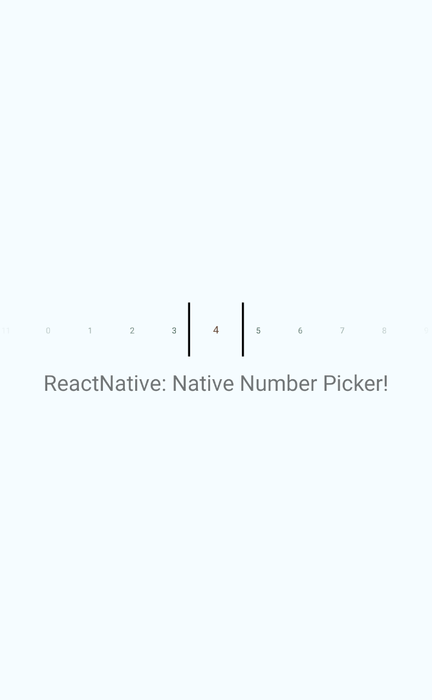
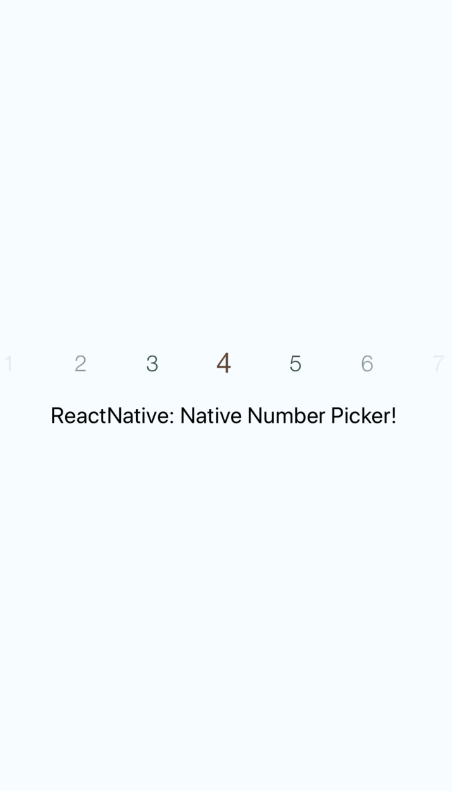

<h1 align="center">

<p align="center">
  <a href="https://www.npmjs.com/package/react-native-number-selector"></a>
  <a href="https://github.com/prscX/react-native-number-selector/pulls"></a>
  <a href="https://github.com/prscX/react-native-number-selector#License"></a>
</p>


    ReactNative: Native Number Selector (Android/iOS)

If this project has helped you out, please support us with a star 🌟
</h1>

This library is a React Native bridge around native number selector libraries. It allows show/guide beautiful number selection:

| **Android: [ShawnLin013/NumberPicker](https://github.com/ShawnLin013/NumberPicker)**             |
| ----------------- |
|                   |


| **iOS: [akkyie/AKPickerView](https://github.com/akkyie/AKPickerView)**             |
| ----------------- |
|                   |


## 📖 Getting started

`$ yarn add react-native-number-selector`

## **RN60 >= RNNS V1 >**

> RN60 above please use `react-native-number-selector` V1 and above

- **iOS**

> **iOS Prerequisite:** Please make sure `CocoaPods` is installed on your system

	- Add the following to your `Podfile` -> `ios/Podfile` and run pod update:

```
  pod 'AKPickerView', :git => 'https://github.com/prscX/AKPickerView.git'

  use_native_modules!

  pod 'RNNumberSelector', :path => '../node_modules/react-native-number-selector/ios'
```

- **Android**

## **RN60 < RNNS V1 <**

> RN60 below please use `react-native-number-selector` V.0.*


`$ react-native link react-native-number-selector`

- **Android**

Please add below snippet into your app build.gradle

```

buildscript {
    repositories {
        jcenter()
        maven { url "https://maven.google.com" }
    }
    ...
}

allprojects {
    repositories {
        mavenLocal()
        jcenter()
        maven { url "https://maven.google.com" }
        ...
    }
}

dependencies {
    implementation 'androidx.appcompat:appcompat:1.0.2'
    implementation 'com.google.android.material:material:1.1.0-alpha03'
    implementation project(':react-native-number-selector')
    implementation 'com.android.support:appcompat-v7:28.0.0'
}

```

> **Note:** This library is supported Android SDK 28 > above

- **iOS**
  - After `react-native link react-native-number-selector`, please verify `node_modules/react-native-number-selector/ios/` contains `Pods` folder. If does not exist please execute `pod install` command on `node_modules/react-native-number-selector/ios/`, if any error => try `pod repo update` then `pod install`
  - After verification, open your project and create a folder 'RNNumberSelector' under Libraries.
  - Drag `node_modules/react-native-number-selector/ios/pods/Pods.xcodeproject` into RNNumberSelector, as well as the RNNumberSelector.xcodeproject if it does not exist.
  - Add the `AKPickerView.framework` into your project's `Embedded Binaries` and make sure the framework is also in linked libraries.
  - Go to your project's `Build Settings -> Frameworks Search Path` and add `${BUILT_PRODUCTS_DIR}/AKPickerView` non-recursive.

  - Now build your iOS app through Xcode


## 💻 Usage

```javascript
import { RNNumberPicker } from 'react-native-number-selector';

```

```javascript

<RNNumberSelector style={{ left: 0, width: '100%', height: 50 }} items={items} selectedItem={4} spacing={50} highlightedFontSize={25} fontSize={20} textColor={'#345345'} highlightedTextColor={'#634534'} viewAnimation={0}  onChange={(number) => {
    console.log('selected: ' + number)
}}/>

```

## 💡 Props

- **Props: Generic**

| Prop              | Type       | Default | Note                                                                                                       |
| ----------------- | ---------- | ------- | ---------------------------------------------------------------------------------------------------------- |
| `items`       | `array[int]`     |         | Specify array of numbers wanted for the display
| `selectedItem` | `int` |         | Specify number you want to show as default selected                                                   |  |
| `fontSize`    | `int`     |         | Specify font size of the text                                        |  |
| `highlightedFontSize`    | `int`     |         | Specify highlighted font size of the text                                        |  |
| `textColor`    | `string #HEX-COLOR`     |         | Specify color of text                                        |  |
| `highlightedTextColor`    | `string #HEX-COLOR`     |         | Specify color of highlighted text color                                        |  |
| `onChange`      | `func`     |         | Specify onChange function to listen for value selection/change


- **Props: Android**

| Prop              | Type       | Default | Note                                                                                                       |
| ----------------- | ---------- | ------- | ---------------------------------------------------------------------------------------------------------- |
| `dividerColor`      | `string`     |   #000000      | Specify divider color, available only for Android platform


## ✨ Credits

- Android: [ShawnLin013/NumberPicker](https://github.com/ShawnLin013/NumberPicker)
- iOS: [akkyie/AKPickerView](https://github.com/akkyie/AKPickerView)


## 🤔 How to contribute
Have an idea? Found a bug? Please raise to [ISSUES](https://github.com/prscX/react-native-number-selector/issues).
Contributions are welcome and are greatly appreciated! Every little bit helps, and credit will always be given.

## 💫 Where is this library used?
If you are using this library in one of your projects, add it in this list below. ✨


## 📜 License
This library is provided under the Apache License.

RNPopoverMenu @ [prscX](https://github.com/prscX)

## 💖 Support my projects
I open-source almost everything I can, and I try to reply everyone needing help using these projects. Obviously, this takes time. You can integrate and use these projects in your applications for free! You can even change the source code and redistribute (even resell it).

However, if you get some profit from this or just want to encourage me to continue creating stuff, there are few ways you can do it:
* Starring and sharing the projects you like 🚀
* If you're feeling especially charitable, please follow [prscX](https://github.com/prscX) on GitHub.

  <a href="https://www.buymeacoffee.com/prscX" target="_blank"></a>

  Thanks! ❤️
  <br/>
  [prscX.github.io](https://prscx.github.io)
  <br/>
  </ Pranav >